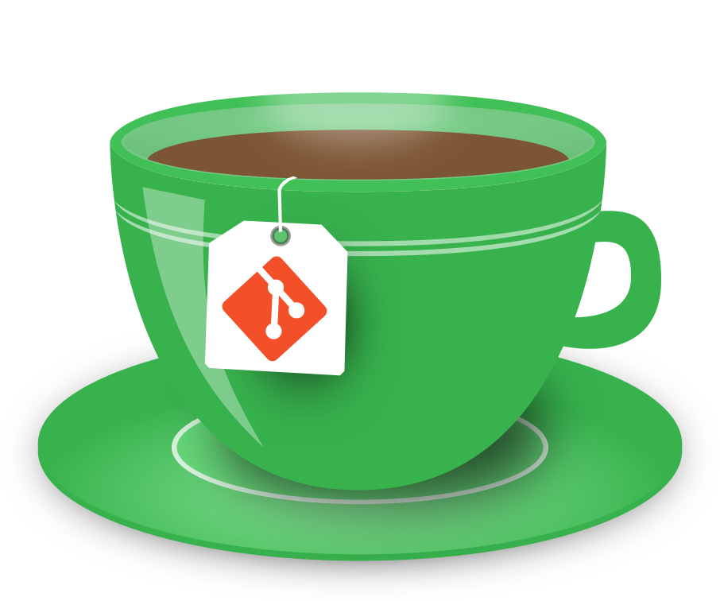

<h1 align="center">Gitea Test</h1>

<h4 align="center">Versionamiento de código autoalojado</h4>

 

  

  

  
  
  
  
  
  
  
  
  
  
  
  
  

  <a href="http://staging.smandes.gov.ar/gitea/Documentacion/gitea/wiki">Lea más acerca de su implementación</a>

 

---

 

<h3 align="center">Sponsors</h3>

 

    Support this project by becoming a sponsor. Your logo will show up here with a link to your website.

[[Become a sponsor](https://opencollective.com/gitea#sponsor)]

 

 

---

 

<h3 align="center">License</h3>

 

   This project is licensed under the MIT License.

See the [LICENSE](https://github.com/go-gitea/gitea/blob/main/LICENSE) file
for the full license text.

 

---

 

<h3 align="center">Screenshots</h3>

 

   Looking for an overview of the interface? Check it out!

 

|               |     |  |
| :--------------------------------------------------------------------------: | :------------------------------------------------------------------: | :-----------------------------------------------------------------: |
|                     |         |            |
|               |           |              |
|  |  |          |

 

---

  

#### Repositorio oficial

Gitea [github](https://github.com/go-gitea/gitea)
